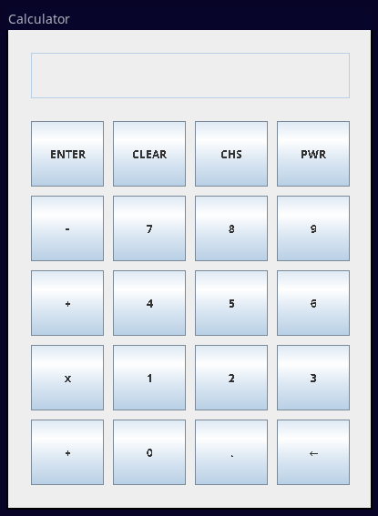

## What is RPN?

Reverse Polish Notation (RPN) calculators, also known as postfix calculators, offer a distinctive and efficient approach to mathematical computation. Unlike traditional calculators that use infix notation (e.g., 3 + 4), RPN calculators process expressions in a postfix format (e.g., 3 4 +).

## RPN Calculator
In RPN, operators follow their operands, simplifying complex calculations by eliminating the need for parentheses or worrying about operator precedence. Users input numbers and operators one at a time, and the calculator stacks them in a way that inherently respects the order of operations. This stack-based methodology makes RPN calculators not only powerful for advanced mathematical tasks but also reduces the chances of errors in complex expressions.

Crafted in Java, this Reverse Polish Notation (RPN) calculator app offers a straightforward and efficient approach to mathematical calculations. With a user-friendly interface and stack-based input, it simplifies complex equations and enhances computational ease
##

